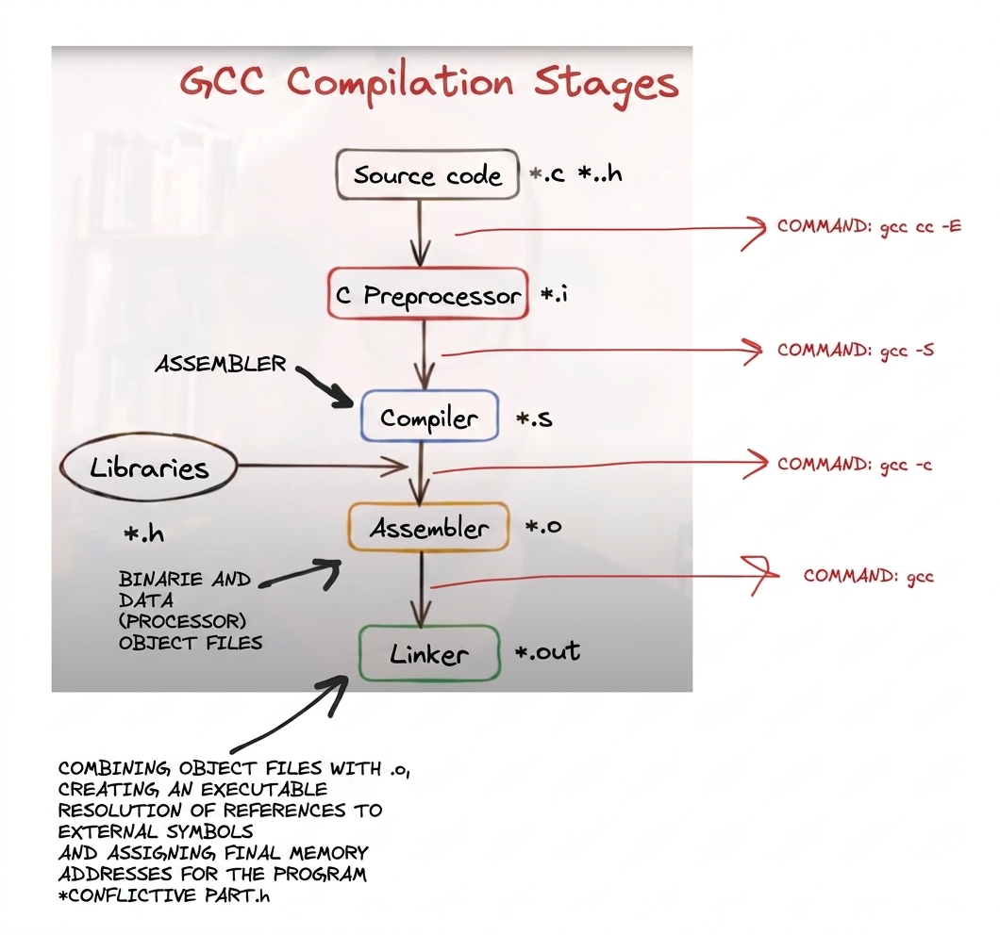

# Libft

<div align="center">
	<strong><span style="font-size: 1.25em;">My own library from scratch in C</span></strong>
	<br />
	<br />
	<a href="https://42.fr/">
		
	</a>
	<a href="https://en.cppreference.com/w/c">
		
	</a>
	<a href="https://www.gnu.org/software/make/">
		
	</a>
</div>


## 📖 Overview
Libft is the first project in the 42 curriculum. The goal is to build your own C library by reimplementing a set of standard C functions. At 42, you cannot use external libraries, so this project becomes the base library you will reuse in later Common Core projects.

This project is meant to understand how C works under the hood: memory allocation, pointer handling, variables, function prototypes, and the compilation flow. Each function comes with constraints, which helps develop problem-solving skills and a low-level understanding of how these functions actually behave. It also focuses on improving your programming logic skills and creating a static library (`.a`).


## 🔧 Requirements
```bash
# Debian/Ubuntu
sudo apt-get update
sudo apt-get install -y gcc
sudo apt-get install -y make
sudo apt-get install -y libc6-dev
```

## 👷 Build
```bash
git clone https://github.com/alcarril/Libft.git # Clone the repository
cd Libft # Navigate to the project directory

make #Build the library

make clean # Clean object files
make fclean # Remove objects and library
make re # Full rebuild
```

## ▶️ Use
```c
// main.c
#include "libft.h"

int main(void)
{
	// Example: use any libft function here
	ft_putstr_fd("Hello, Libft!\n", 1);
	return 0;
}
```

```bash
# Build the library first
make

# Compile and link with the static library
cc main.c -L. -lft -o main
```

## 🛑 Restrictions
Each function must match a specific behavior. You can verify the original behavior using the C manuals and then replicate it.

Only a small set of functions is allowed to help you replicate the originals (usually `write` and memory allocation/free functions). Everything else must be done with your own programming logic.

All functions are written following the 42 Norminette, the style checker that standardizes how we code and enforces syntax-level restrictions.

## 🎯 Functions
Note: internal calls list only standard library/system functions used directly (not custom helpers).

### Basic functions

#### is_* checks

```c
// ft_isalnum
int ft_isalnum(int c);
// Internal calls: none
```

```c
// ft_isalpha
int ft_isalpha(int c);
// Internal calls: none
```

```c
// ft_isascii
int ft_isascii(int c);
// Internal calls: none
```

```c
// ft_isdigit
int ft_isdigit(int c);
// Internal calls: none
```

```c
// ft_isprint
int ft_isprint(int c);
// Internal calls: none
```

#### ASCII transformations

```c
// ft_tolower
int ft_tolower(int c);
// Internal calls: none
```

```c
// ft_toupper
int ft_toupper(int c);
// Internal calls: none
```

#### String copy and checks

```c
// ft_strchr
char *ft_strchr(const char *s, int c);
// Internal calls: none
```

```c
// ft_strlcat
size_t ft_strlcat(char *dst, const char *src, size_t size);
// Internal calls: none
```

```c
// ft_strlcpy
size_t ft_strlcpy(char *dst, const char *src, size_t size);
// Internal calls: none
```

```c
// ft_strlen
size_t ft_strlen(const char *s);
// Internal calls: none
```

```c
// ft_strncmp
int ft_strncmp(const char *s1, const char *s2, size_t n);
// Internal calls: none
```

```c
// ft_strnstr
char *ft_strnstr(const char *str, const char *to_find, size_t n);
// Internal calls: none
```

```c
// ft_strrchr
char *ft_strrchr(const char *s, int c);
// Internal calls: none
```

#### Memory handling

```c
// ft_bzero
void ft_bzero(void *s, size_t n);
// Internal calls: none
```

```c
// ft_memchr
void *ft_memchr(const void *s, int c, size_t n);
// Internal calls: none
```

```c
// ft_memcmp
int ft_memcmp(const void *s1, const void *s2, size_t n);
// Internal calls: none
```

```c
// ft_memcpy
void *ft_memcpy(void *dst, const void *src, size_t n);
// Internal calls: none
```

```c
// ft_memmove
void *ft_memmove(void *dst, const void *src, size_t n);
// Internal calls: none
```

```c
// ft_memset
void *ft_memset(void *s, int c, size_t n);
// Internal calls: none
```

#### Type conversions

```c
// ft_atoi
int ft_atoi(const char *nptr);
// Internal calls: none
```

```c
// ft_itoa
char *ft_itoa(int n);
// Internal calls:
void *malloc(size_t size);
```

#### Memory allocation and advanced features

```c
// ft_calloc
void *ft_calloc(size_t nmemb, size_t size);
// Internal calls:
void *malloc(size_t size);
void free(void *ptr);
```

```c
// ft_strdup
char *ft_strdup(const char *s);
// Internal calls:
void *malloc(size_t size);
void free(void *ptr);
```

```c
// ft_strjoin
char *ft_strjoin(char const *s1, char const *s2);
// Internal calls:
void *malloc(size_t size);
void free(void *ptr);
```

```c
// ft_substr
char *ft_substr(char const *s, unsigned int start, size_t len);
// Internal calls:
void *malloc(size_t size);
void free(void *ptr);
```

```c
// ft_strtrim
char *ft_strtrim(char const *s1, char const *set);
// Internal calls:
void *malloc(size_t size);
void free(void *ptr);
```

```c
// ft_split
char **ft_split(char const *s, char c);
// Internal calls:
void *malloc(size_t size);
void free(void *ptr);
```


#### put_* output

```c
// ft_putchar_fd
void ft_putchar_fd(char c, int fd);
// Internal calls:
ssize_t write(int fd, const void *buf, size_t count);
```

```c
// ft_putendl_fd
void ft_putendl_fd(char *s, int fd);
// Internal calls:
ssize_t write(int fd, const void *buf, size_t count);
```

```c
// ft_putnbr_fd
void ft_putnbr_fd(int n, int fd);
// Internal calls:
ssize_t write(int fd, const void *buf, size_t count);
```

```c
// ft_putstr_fd
void ft_putstr_fd(char *s, int fd);
// Internal calls:
ssize_t write(int fd, const void *buf, size_t count);
```

#### Callbacks

```c
// ft_striteri
void ft_striteri(char *s, void (*f)(unsigned int, char *));
// Internal calls: none
```

```c
// ft_strmapi
char *ft_strmapi(char const *s, char (*f)(unsigned int, char));
// Internal calls:
void *malloc(size_t size);
void free(void *ptr);
```

### Linked list functions

These functions introduce structures and linked lists, creating utilities to build nodes, add them to the front or back, and iterate or transform lists.

```c
// ft_lstadd_back
void ft_lstadd_back(t_list **lst, t_list *new);
// Internal calls: none
```

```c
// ft_lstadd_front
void ft_lstadd_front(t_list **lst, t_list *new);
// Internal calls: none
```

```c
// ft_lstclear
void ft_lstclear(t_list **lst, void (*del)(void *));
// Internal calls:
void free(void *ptr);
```

```c
// ft_lstdelone
void ft_lstdelone(t_list *lst, void (*del)(void *));
// Internal calls:
void free(void *ptr);
```

```c
// ft_lstiter
void ft_lstiter(t_list *lst, void (*f)(void *));
// Internal calls: none
```

```c
// ft_lstlast
t_list *ft_lstlast(t_list *lst);
// Internal calls: none
```

```c
// ft_lstmap
t_list *ft_lstmap(t_list *lst, void *(*f)(void *), void (*del)(void *));
// Internal calls: none
```

```c
// ft_lstnew
t_list *ft_lstnew(void *content);
// Internal calls:
void *malloc(size_t size);
```

```c
// ft_lstsize
int ft_lstsize(t_list *lst);
// Internal calls: none
```

## ⚙️ Compilation process and headers

### C compilation steps
The C compiler is a program that parses the language and transforms it through several phases until producing an executable file that the OS can run.



1. Preprocessor: expands macros, includes headers, and handles directives like `#define`.
2. Compilation: translates C source into assembly.
3. Assembly: converts assembly into object files.
4. Linking: combines objects and libraries into the final executable (or static/dynamic library).

Tips: use `-v` to see each phase, and `-ftime-report` to measure how long each phase takes.

---

### Headers (.h)
A header file groups definitions that live in different source files through a single reference file that contains all prototypes. This lets you use functions that are not defined in the same `.c` file by adding `#include "header_name.h"`.

Headers can also include other headers. To avoid double inclusion and related warnings/errors, use preprocessor guards like `#ifndef`, `#define`, and `#endif`. Combined with precompiled object files (`.o`) and static libraries, this lets you build your own code libraries and reuse them easily across projects.

- Function prototypes declare the name and parameters of each function and end with `;`.
- Prototypes help the linker when functions are defined in different files or declared above their definition.
- `typedef` creates type aliases and can be used in headers or source files.
- Use include guards to avoid double inclusion and duplicate declarations.
- When headers live outside the current directory, pass include paths with `-I` during compilation.

## 🧾 Makefile

A Makefile is a small build program: it parses a recipe (targets, variables, and rules) and executes commands based on dependencies. Rules are command lists attached to targets, and dependencies let one rule trigger another so you can control the compilation pipeline.

In C, the most practical use is incremental builds: when a single file changes, only its object is rebuilt instead of recompiling the entire library. This is driven by Makefile dependency rules.

Make can do much more (create directories, run scripts, orchestrate big builds), and later in the course it is used for deployment or multi-tech workflows. Makefiles can also call other Makefiles, which lets one build recipe trigger another.

Key ideas used in this project:
```makefile
# all depends on the final library to avoid relinking every time
all: $(NAME)

# $(NAME) depends on objects so only changed files rebuild
$(NAME): $(OBJS)
	# ar rcs: replace/add objects, create if missing, and index symbols
	ar rcs $(NAME) $(OBJS)
```

Common targets:
```makefile
# Build the library
all: $(NAME)

# Remove object files
clean:
	rm -f *.o

# Remove objects and the library
fclean: clean
	rm -f $(NAME)

# Full rebuild
re: fclean all
```

## 🔗 Resources

### C
- https://www.makigas.es/series/tutorial-de-c
- `man <function>` (RTFM)

### Compilation
- https://www.youtube.com/watch?v=QXjU9qTsYCc
- https://www.ibm.com/docs/es/openxl-c-and-cpp-aix/17.1.1?topic=cc-compiler-phases

### Headers (.h)
- https://www.youtube.com/watch?v=5UMHbzZGQuE
- https://www.youtube.com/watch?v=Aq9fXMevXis
- https://www.youtube.com/watch?v=4fc-QRl8_QQ

### Makefile
- https://www.youtube.com/watch?v=BD0giwqBbm0
- https://www.youtube.com/watch?v=0XlVyZAfQEM
- https://docs.redhat.com/es/documentation/red_hat_enterprise_linux/8/html/developing_c_and_cpp_applications_in_rhel_8/example-building-a-c-program-using-a-makefile_managing-more-code-with-make
- https://www.gnu.org/software/make/manual/make.html

## 👨‍💻 Author
**Alejandro Carrillo** - https://github.com/alcarril
